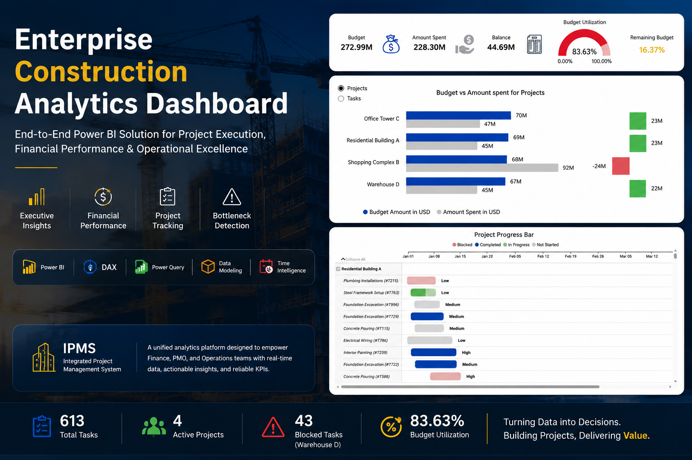

# Enterprise Construction Analytics Dashboard

### End-to-End Power BI Solution for Executive Project Management & Financial Analytics

Power BI • DAX • Power Query • Data Modeling • Time Intelligence • Executive Reporting
This project demonstrates an enterprise-grade Business Intelligence solution built in Power BI to monitor construction project execution, budget performance, operational bottlenecks, and executive KPIs. It combines advanced DAX, Time Intelligence, dynamic Field Parameters, and interactive reporting to support data-driven decision-making across Finance, PMO, and Operations.

  

Case Study: Integrated Project Management System (IPMS)
---
**Client / Company:** Al-Bina'a Construction  
**Role:** Data Analyst & Power BI Developer  
**Focus:** Enterprise Analytics Architecture & Strategic Reporting  

---

## 1. The Business Context & Problem Statement
Al-Bina'a Construction manages large-scale, concurrent infrastructure developments (e.g., Office Tower C, Residential Building A, Shopping Complex B, Warehouse D). Executive management was operating under "data blindness" due to operational data fragmentation across active physical sites, the Project Management Office (PMO), and the Finance department.

This organizational silo led to critical operational deficiencies:
* **Delayed Decision-Making:** Operational bottlenecks and site roadblocks ("Blocked" tasks) went unreported in real time, causing project delays and triggering severe contractual financial penalties.
* **Financial Hemorrhaging & Fiscal Risk:** Financial controllers lacked an automated, consolidated mechanism to map original budget allocations against actual expenditures at both project and granular task levels, resulting in uncontrolled over-budget scenarios.
* **Resource Misallocation:** Lack of cross-departmental alignment hampered the strategic reallocation of labor and materials from ahead-of-schedule sites to underperforming projects.

---

## 2. Data Strategy & Schema Architecture
To establish a single source of truth, an integrated data model was architected from raw operational datasets, standardizing data definitions across the following core attributes:
* **Project Identifiers:** Project ID, Project Name, and Site Location.
* **Task Engineering:** Task ID, Task Name, and Department/Assigned Role (mapping workflows to specific cost centers).
* **Status & Urgency:** Task Status (Blocked, In Progress, Completed, Not Started) and Priority levels (High, Medium, Low).
* **Chronological Data:** Start Date, Due Date, and Actual Completion Date (driving time intelligence metrics).
* **Performance Metrics:** Completion Progress (%), Budget Amount ($), and Actual Amount Spent ($).

---

## 3. Stakeholder-Driven Solution Architecture (User Personas)
A unified, multi-layered interactive dashboard was deployed, utilizing custom reporting tiers optimized specifically for individual stakeholder groups:

### Financial Department (CFO & Board Perspective)
* **Core Objective:** Complete financial health transparency and early detection of fiscal anomalies.
* **High-Level Financial KPIs:** Monitors the global financial footprint, highlighting an aggregate Budget of **$272.99M** versus an Actual Amount Spent of **$228.30M**, leaving an active Balance of **$44.69M**.
* **Budget Utilization Analytics:** A dynamic Gauge visualizes an overall consumption rate of **83.63%**, indicating that **16.37%** of original funds remain available.
  
* **Project-Level Variance Tracking:** Employs explicit financial thresholds via conditional formatting. For instance, **Shopping Complex B** is immediately flagged as a high-risk asset with a negative variance of **-$24M** (Spent: $92M | Budget: $68M), while healthy sites like Office Tower C remain under-budget.

### Project Management Office (PMO Perspective)
* **Core Objective:** Spotting site delays, measuring workload volume, and cross-site productivity benchmarking.
* **AI-Driven Root Cause Analysis:** Integrates a *Decomposition Tree (Tasks Explain)* to seamlessly dissect total project tasks (613 total corporate tasks) down through specific projects, priority tiers, and current workflow status.
* **Blocker Assessment Metrics:** Isolates volume constraints per project using stacked columns. This surfaces that **Warehouse D** accounts for the highest operational friction with 43 "Blocked" tasks, necessitating immediate administrative intervention.

### Operations & Site Management Perspective
* **Core Objective:** Real-time task tracking, bottleneck identification, and direct supervisor accountability.
* **Interactive Progress Matrix:** Deploys an intuitive Gantt-style progress bar showcasing real-time operational status per engineering task (e.g., *Steel Framework Setup*, *Concrete Pouring*).
* **Traffic-Light Task Grouping:** Leverages color-coded operational identifiers (Pink for Blocked, Green for In Progress, Blue for Completed, Grey for Not Started) combined with hardcoded Task Priority indicators to streamline field execution.

---

## 4. Advanced Technical Implementation & DAX Architecture
To deliver a highly optimized, responsive consumer-grade application and clean UI/UX, several advanced Power BI capabilities were engineered:

* **Dynamic Field Parameters for Granular Drill-Down:** Engineered robust `Field Parameters` that grant users the ability to dynamically alter the axis of core charts on-the-fly. Executives can switch the entire analysis visual between a high-level **Project perspective** and a granular **Task perspective** with a single click, keeping data discovery seamless and efficient without cluttering the canvas.
* **Advanced Time Intelligence & S-Curve Formulation:** Developed an optimized DAX measures architecture to monitor financial trajectories over complex chronological periods. This includes **Cumulative Spend** calculations to plot precise financial S-Curves over time, and **Year-over-Year (YoY) Growth** parameters to compare historical project velocity and fiscal spending patterns against the current calendar year.
* **Context-Aware Dynamic Titles:** Wrote string-manipulation DAX measures to inject automated, reactive titles across all reporting canvases. Titles automatically compute based on active slicer selections (e.g., *"Budget Analysis for Tasks assigned to Dave Brown at Q1 2023"*), ensuring users never misinterpret the active filtering context.
* **Canvas Real-Estate Optimization via Bookmarks & Selection Panels:** To maximize data density without causing user cognitive overload, data-driven `Bookmarks` and the `Selection Pane` were used to construct a high-performance visual toggle mechanism. This allows users to switch between **Trend Analysis** and **Cumulative Analysis** within the exact same screen real estate, preserving layout symmetry and boosting UI/UX performance.

---

## 5. Quantifiable Business Impact & Delivered Value
1.  **Elimination of Reporting Asymmetry:** Replaced scattered offline sheets with a central source of truth, reducing weekly project review alignment sessions by over 40%.
2.  **Proactive Capital Mitigation:** Equipped the CFO with early-warning indicators to flag over-budget trajectories (e.g., Shopping Complex B) in real time, saving hundreds of thousands in potential cost overruns.
3.  **Accelerated Bottleneck Resolution:** Empowered operations managers to isolate blocked dependencies immediately, driving a faster resolution rate of site issues and keeping critical-path tasks on schedule.
